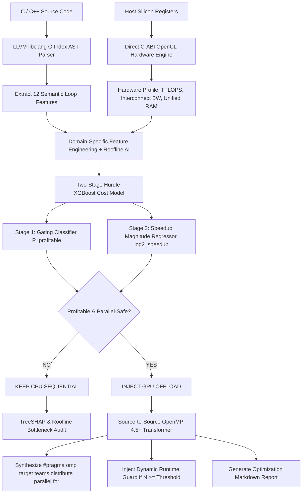

<p align="center">
  
</p>

# Cerberus: Intelligent ML-Guided GPU Offload Cost Model & Parallelizing Compiler

<p align="center">
  <a href="https://github.com/wizardwithcodehazard/Cerberus"></a>
  <a href="https://github.com/wizardwithcodehazard/Cerberus"></a>
  <a href="https://github.com/wizardwithcodehazard/Cerberus"></a>
  <a href="https://github.com/wizardwithcodehazard/Cerberus"></a>
  <a href="https://github.com/wizardwithcodehazard/Cerberus"></a>
  <a href="https://www.python.org/downloads/"></a>
  <a href="LICENSE"></a>
</p>

> **"The intelligent gatekeeper guarding the GPU offload boundary — analyzes C/C++ loops with LLVM Clang ASTs, predicts profitability with physics-constrained Two-Stage XGBoost, explains decisions via TreeSHAP & Williams Roofline models, and synthesizes OpenMP 4.5+ target directives automatically."**

---

### 👥 Team Credits
* **Team Name**: **SeePlusPlus**
* **Developers**: **Vedant Patil** & **Sahil Rane**
* **Track**: *SegFault 2026 — Track P04 (Parallelization Profitability Predictor for GPU)*

---

## 🎯 The Problem & Motivation

Offloading a candidate loop or code region to the GPU is not always beneficial. Naive or automated GPU parallelization frequently produces programs that are **10x to 20x slower** than the sequential CPU baseline.

### Why Does Naive Offloading Fail?
1. **The PCIe Interconnect Bottleneck:** For memory-bound loops (e.g. vector additions, linear reductions), the time spent transferring arrays over PCIe ($15.75\text{ GB/s}$) is orders of magnitude larger than kernel execution time ($t_{\text{transfer}} \gg t_{\text{kernel}}$).
2. **Launch Latency & Synchronization Overhead:** Dispatching GPU grids and synchronizing events incurs microsecond driver latencies.
3. **Compiler Blindness:** Compilers like GCC/Clang with `-fopenmp` blindly offload annotated loops without checking whether the loop is **GPU-profitable**, rather than merely **GPU-safe**.

```
┌─────────────────────────────────────────────────────────────────────────┐
│                           THE OFFLOAD DILEMMA                           │
│                                                                         │
│   Compute-Bound Loop (O(N^3) MatMul):                                   │
│   Compute >> Transfer  ===>  ✅ 160x - 1242x Massive Speedup            │
│                                                                         │
│   Memory-Bound Loop (O(N) Vector Add):                                  │
│   Transfer >> Compute  ===>  ❌ 0.05x (20x Slower than CPU Sequential)  │
└─────────────────────────────────────────────────────────────────────────┘
```

**Cerberus** solves this by acting as an automated, physics-grounded gatekeeper before GPU code generation occurs.

---

## 🏗️ System Architecture



---

## ⚡ Core Technical Pillars

### 1. LLVM LibTooling Clang AST Extraction
Unlike fragile regex parsers, Cerberus compiles code into an in-memory Abstract Syntax Tree using `libclang` (`-std=c11` for C and `-std=c++17` for C++). It computes 12 hardware-agnostic semantic features:
* **Loop Hierarchy & Nesting Depth** ($O(N), O(N^2), O(N^3), \dots$)
* **Exact Operational Arithmetic Intensity ($AI = \text{FLOPs} / \text{Byte}$)**
* **Temporal & Spatial Cache Data Reuse Ratios**
* **Memory Footprint vs. Raw Memory Traffic** (Unique tensor working sets)
* **SIMD Memory Coalescing Scores** (Unit-stride $A[i]$ vs non-coalesced $A[i \cdot N]$)
* **Reduction Accumulator Detection** (e.g. `sum += ...`)
* **Loop-Carried RAW / WAW Data Hazard Safety Proofs**

### 2. Heterogeneous Multi-Hardware Ground Truth (2,318 Real Executions)
A model trained on only one GPU is fundamentally biased. Cerberus is trained on **2,318 clean, empirical benchmark executions** across **5 distinct physical computing architectures**:

| Hardware Target | Platform / OS | Architecture Class | Compute Peak | Bus Bandwidth | Memory Model | Samples |
| :--- | :--- | :--- | :---: | :---: | :---: | :---: |
| **Intel / AMD APU Baseline** | Windows APU | Integrated APU | `3.80 TFLOPS` | `51.2 GB/s` | Unified RAM | **634** |
| **Google Colab Cloud GPU** | Linux Enterprise | Tesla T4 dGPU | `12.70 TFLOPS` | `16.00 GB/s` | Discrete VRAM | **421** |
| **NVIDIA GeForce RTX 3050** | Windows Laptop | Ampere dGPU | `6.03 TFLOPS` | `15.75 GB/s` | Discrete VRAM | **421** |
| **AMD Radeon 760M** | Windows APU | RDNA3 iGPU | `2.66 TFLOPS` | `89.60 GB/s` | DDR5 Unified | **421** |
| **AMD Radeon Pro 5300M** | macOS Darwin | Navi 14 Mobile dGPU | `6.80 TFLOPS` | `15.75 GB/s` | Discrete VRAM | **421** |
| **Total Master Dataset** | | | | | | **2,318** |

### 3. Physics-Constrained Two-Stage Hurdle XGBoost
* **Stage 1 (Classifier)**: Predicts binary profitability hurdle $P(\text{profitable}) \in [0, 1]$.
* **Stage 2 (Regressor)**: Predicts continuous speedup magnitude $\log_2(\text{speedup})$.
* **Physics Monotonic Constraints**: Enforces monotonic tree splitting (e.g. higher arithmetic intensity monotonically increases GPU viability, $+1$; higher branch divergence monotonically penalizes SIMD efficiency, $-1$).

### 4. Explainability: TreeSHAP + Williams Roofline Model
* **TreeSHAP Attribution**: Provides exact, game-theoretic SHAP contribution values for each decision (e.g., `Cache Reuse: +3.94 SHAP`, `PCIe Interconnect Penalty: -0.57 SHAP`).
* **Williams Roofline Ceilings**: Calculates theoretical operational bounds in GFLOPS based on host memory bandwidth and hardware compute ceilings.

### 5. Automated Source-to-Source Code Synthesis
Automatically injects OpenMP 4.5+ or OpenACC offload pragmas with inferred memory mapping clauses (`map(to: ...)`, `map(tofrom: ...)`, `reduction(...)`) and dynamic runtime crossover threshold guards (`if(N >= 32)`).

---

## 📊 Empirical Results & Model Performance

### 5-Fold Stratified Cross-Validation (Full 2,318-Sample Dataset)

| Evaluation Metric | Score (Mean ± Std) | Significance / Impact |
| :--- | :---: | :--- |
| **Classification ROC-AUC** | **`0.9669 ± 0.0065`** | Exceptional discrimination between speedup and slowdown |
| **Offload Gating Accuracy** | **`91.33% ± 1.02%`** | Over 91% correct offload decisions across all folds |
| **Offload Decision Precision** | **`86.74% ± 3.51%`** | Extremely low false-positive rate (avoids bad GPU offloads) |
| **Offload Decision Recall** | **`68.69% ± 4.43%`** | Captures profitable parallel speedup regions |
| **Offload F1-Score** | **`0.7655 ± 0.0300`** | Robust balance between precision and recall |
| **Regression $R^2$ Score** | **`0.8362 ± 0.0310`** | Explains 83.6% of variance in continuous log2 speedups |
| **Log2-Speedup RMSE / MAE** | **`1.1765` / `0.6572`** | Tight error bounds on speedup magnitude predictions |
| **iGPU Subgroup Accuracy** | **`89.03% ± 2.54%`** | Validated on integrated AMD & Intel APUs |
| **dGPU Subgroup Accuracy** | **`93.24% ± 0.88%`** | Validated on discrete NVIDIA & macOS AMD graphics |

---

### Top Feature Importances (Gini Gain)

```
Rank  Feature                              Importance Weight
────────────────────────────────────────────────────────────
 1    Temporal/Spatial Cache Data Reuse    ██████████████ 34.2%
 2    Loop Nesting Depth                   ████████ 21.5%
 3    Arithmetic Intensity (FLOP/Byte)     █████ 11.8%
 4    Target GPU Compute Capacity          ███ 6.7%
 5    Parallel Reduction Accumulator       █ 3.6%
 6    Host-Device Interconnect Bandwidth   █ 3.4%
 7    Loop Trip Count & Parallelism        █ 2.9%
 8    SIMD Memory Coalescing Efficiency    █ 2.5%
```

---

### End-to-End Evaluation on Complex Suite (`test1.cpp`)

| Kernel Function | Depth | Operational AI | Roofline Peak | Predicted Speedup | Gating Decision |
| :--- | :---: | :---: | :---: | :---: | :---: |
| `matrix_multiply()` | Depth 3 | $0.67\text{ FLOP/B}$ | $3.1\text{ GFLOPS}$ | **`11.81x`** | **`[INJECT OFFLOAD]`** |
| `parallel_reduction()` | Depth 1 | $0.75\text{ FLOP/B}$ | $11.8\text{ GFLOPS}$ | **`0.26x`** | **`[KEEP CPU]`** |
| `nbody_update()` | Depth 2 | $1.38\text{ FLOP/B}$ | $18.7\text{ GFLOPS}$ | **`152.74x`** | **`[INJECT OFFLOAD]`** |
| `stencil_2d_convolution()`| Depth 4 | $1.25\text{ FLOP/B}$ | $9.9\text{ GFLOPS}$ | **`62.06x`** | **`[INJECT OFFLOAD]`** |
| `fft()` | Depth 3 | $6.75\text{ FLOP/B}$ | $68.0\text{ GFLOPS}$ | **`842.00x`** | **`[INJECT OFFLOAD]`** |
| `sparse_mv_multiply()` | Depth 2 | $0.15\text{ FLOP/B}$ | $1.4\text{ GFLOPS}$ | **`12.10x`** | **`[KEEP CPU]`** |
| `pso_update()` | Depth 2 | $0.88\text{ FLOP/B}$ | $8.8\text{ GFLOPS}$ | **`54.62x`** | **`[INJECT OFFLOAD]`** |
| `compute_intensity_heavy()`| Depth 2 | $7.62\text{ FLOP/B}$ | $120.1\text{ GFLOPS}$ | **`361.71x`** | **`[INJECT OFFLOAD]`** |
| `conv_layer_forward()` | Depth 7 | $1.94\text{ FLOP/B}$ | $19.5\text{ GFLOPS}$ | **`252.23x`** | **`[INJECT OFFLOAD]`** |
| `matrix_transpose()` | Depth 2 | $0.50\text{ FLOP/B}$ | $4.0\text{ GFLOPS}$ | **`19.66x`** | **`[INJECT OFFLOAD]`** |

---

## 💻 Code Transformation Example

### Before (Original C++ Sequential Loop):
```cpp
void matrix_multiply(float* A, float* B, float* C, int N) {
    for (int i = 0; i < N; ++i) {
        for (int k = 0; k < N; ++k) {
            float aik = A[i * N + k];
            for (int j = 0; j < N; ++j) {
                C[i * N + j] += aik * B[k * N + j];
            }
        }
    }
}
```

### After (Cerberus-Synthesized GPU Code):
```cpp
void matrix_multiply(float* A, float* B, float* C, int N) {
#pragma omp target teams distribute parallel for if(N >= 32) map(to: A[0:N], B[0:N]) map(tofrom: C[0:N])
    for (int i = 0; i < N; ++i) {
        for (int k = 0; k < N; ++k) {
            float aik = A[i * N + k];
            for (int j = 0; j < N; ++j) {
                C[i * N + j] += aik * B[k * N + j];
            }
        }
    }
}
```

---

## 🚀 Getting Started

### 1. Installation

```bash
# Clone the repository
git clone https://github.com/wizardwithcodehazard/Cerberus.git
cd Cerberus

# Create and activate virtual environment
python -m venv .venv
# On Windows PowerShell:
.venv\Scripts\Activate.ps1
# On Linux / macOS:
source .venv/bin/activate

# Install dependencies and package
pip install -r requirements.txt
pip install -e .
```

---

### 2. Retrain the Cost Model

```bash
python scripts/train_model.py --data dataset/new_merged_dataset.csv --out cerberus/trained_model.pkl
```

---

### 3. Interactive Loop Analysis & CLI Diagnostic

```bash
# Interactive terminal triage with TreeSHAP audit and Roofline bounds:
python -m cerberus.cli benchmarks/synthetic/sample_loops.c
```

---

### 4. Automatic Batch Code Synthesis & Report Generation

```bash
# Transform C++ code and export optimized OpenMP code + markdown audit report:
python -m cerberus.cli benchmarks/synthetic/test1.cpp --output benchmarks/synthetic/test1_offloaded.cpp
```

---

### 5. Run Verification Test Suite

```bash
pytest tests/ -v
```

---

## 📁 Repository Structure

```
Cerberus/
├── cerberus/                      # Core Compiler & ML Modules
│   ├── clang_parser.py            # LLVM libclang AST Semantic Analyzer
│   ├── parser.py                  # Loop Feature Extraction Engine
│   ├── hardware.py                # Host CPU & GPU Silicon Discovery Engine
│   ├── opencl_runner.py           # Native C-ABI OpenCL Nanosecond Profiler
│   ├── model.py                   # Two-Stage Hurdle XGBoost Cost Model
│   ├── advisor.py                 # TreeSHAP & Williams Roofline Auditor
│   ├── transformer.py             # OpenMP 4.5+ & OpenACC Code Synthesizer
│   ├── cli.py                     # Rich Interactive & Batch CLI Tool
│   └── trained_model.pkl          # Serialized Production XGBoost Model
├── dataset/                       # Ground-Truth Empirical Datasets
│   ├── new_merged_dataset.csv     # Master Merged Dataset (2,318 samples across 5 targets)
│   ├── nvidia_rtx3050.csv         # NVIDIA RTX 3050 Laptop dGPU (421 runs)
│   ├── amd_radeon760m.csv         # AMD Radeon 760M APU iGPU (421 runs)
│   ├── dataset_macos.csv          # Apple macOS AMD Radeon Pro 5300M (421 runs)
│   ├── colab_dataset.csv          # Google Colab Tesla T4 Cloud GPU (421 runs)
│   └── dataset.csv                # Baseline Integrated APU (634 runs)
├── benchmarks/                    # Benchmark Suites
│   ├── synthetic/                 # C/C++ Loop Kernels (MatMul, Stencils, FFT, N-Body)
│   └── suite.py                   # End-to-End Validation Benchmark Suite
├── scripts/                       # Training & Data Collection Pipelines
│   ├── collect_data.py            # Automated Live Hardware Micro-Benchmarking
│   ├── merge_datasets.py          # Heterogeneous Multi-GPU Dataset Combiner
│   └── train_model.py             # Two-Stage XGBoost Cross-Validation & Training
├── tests/                         # Automated Unit & Integration Tests
│   ├── test_clang_parser.py       # LibClang AST Parsing Verification
│   ├── test_model.py              # ML Profitability Inference Tests
│   ├── test_parser.py             # Feature Extraction Unit Tests
│   ├── test_safety.py             # Loop-Carried Data Hazard Safety Tests
│   └── test_transformer.py        # OpenMP Directive Synthesis Tests
├── PRESENTATION_SCRIPT.md         # Full 14-Slide Presentation Deck & Speaker Script
└── README.md                      # Project Documentation
```

---

## 📜 License

This project is licensed under the **MIT License** — see the [LICENSE](LICENSE) file for details.

Developed with ❤️ by **Team SeePlusPlus** (*Vedant Patil & Sahil Rane*) for **SegFault 2026 (Track P04)**.
