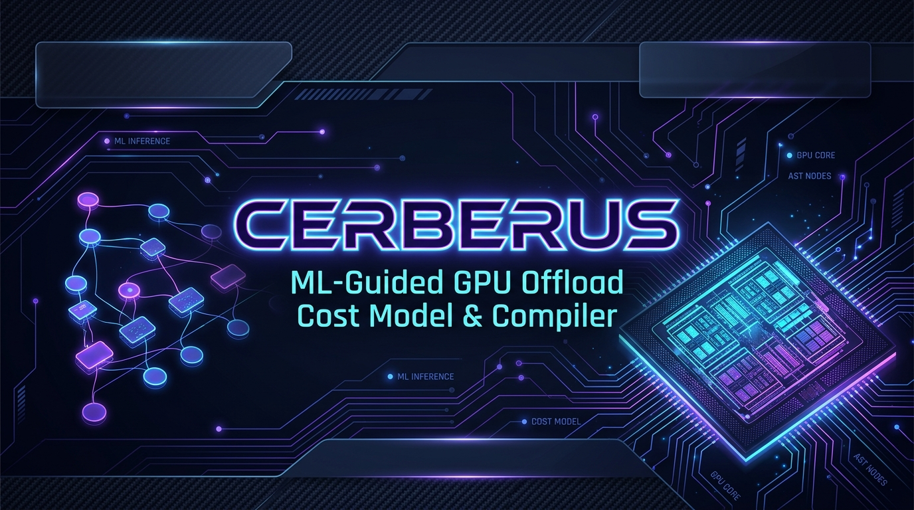
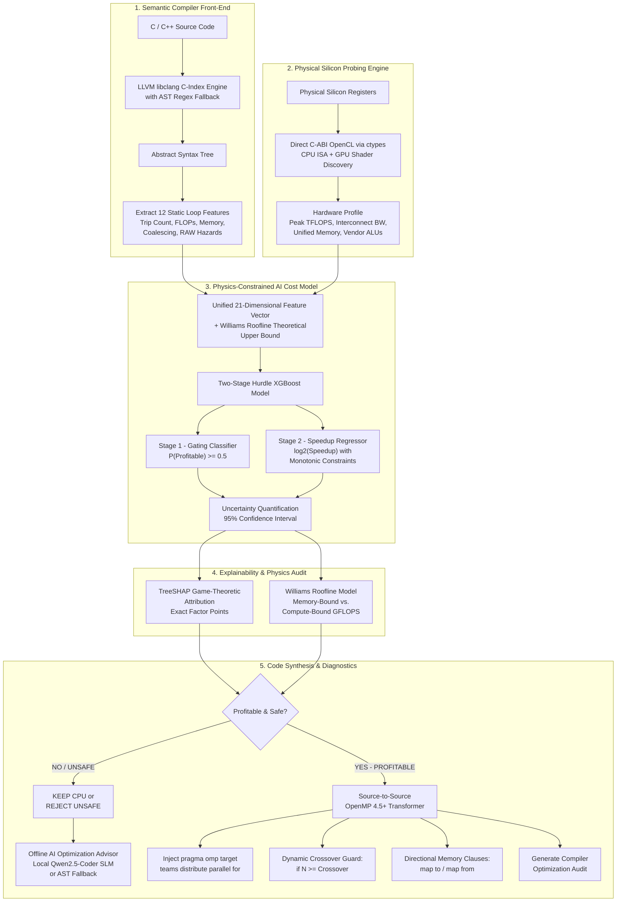
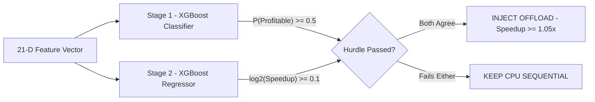

<p align="center">
  
</p>

# Cerberus: Intelligent ML-Guided GPU Offload Cost Model & Parallelizing Compiler

<p align="center">
  <a href="https://github.com/wizardwithcodehazard/Cerberus"></a>
  <a href="https://github.com/wizardwithcodehazard/Cerberus"></a>
  <a href="https://github.com/wizardwithcodehazard/Cerberus"></a>
  <a href="https://github.com/wizardwithcodehazard/Cerberus"></a>
  <a href="https://github.com/wizardwithcodehazard/Cerberus"></a>
  <a href="https://www.python.org/downloads/"></a>
  <a href="LICENSE"></a>
</p>

---

> **The intelligent compiler gatekeeper guarding the GPU offload boundary.**  
> Cerberus analyzes C/C++ loops using **LLVM Clang ASTs**, discovers live silicon registers via **direct C-ABI OpenCL**, predicts offload profitability using a **Physics-Constrained Two-Stage Hurdle XGBoost Model**, explains decisions via **TreeSHAP & Williams Roofline Models**, and synthesizes optimized **OpenMP 4.5+ / OpenACC directives** with dynamic runtime crossover thresholds.

---

## The Problem & Motivation

Offloading a candidate loop or code region to the GPU is not always beneficial. Modern compilers (GCC `-fopenmp`, Clang `-fopenmp-targets`) suffer from **compiler blindness**: they check if a loop is **GPU-safe** (free of loop-carried data races), and if so, blindly offload it.

However, **GPU-Safe != GPU-Profitable**. Naive GPU offloading frequently makes code **10x to 20x slower** than single-threaded CPU baselines due to physical hardware overheads:

```
┌────────────────────────────────────────────────────────────────────────────────────────┐
│                               THE GPU OFFLOAD DILEMMA                                  │
│                                                                                        │
│  1. Compute-Bound Loop (e.g. O(N^3) Matrix Multiplication):                            │
│     Compute Workload >> PCIe Transfer Latency  ===>  [PROFITABLE] 11.8x - 842x Speedup │
│                                                                                        │
│  2. Memory-Bound Loop (e.g. O(N) Vector Addition / Linear Scan):                       │
│     PCIe Transfer Latency >> Compute Workload  ===>  [UNPROFITABLE] 0.05x (20x Slower) │
└────────────────────────────────────────────────────────────────────────────────────────┘
```

### The 4 Major Hardware Killers of GPU Offload:
1. **PCIe Interconnect Serialization:** Transferring gigabytes over a $15.75\text{ GB/s}$ PCIe Gen3/4 bus takes orders of magnitude longer than executing low-arithmetic-intensity loops ($t_{\text{transfer}} \gg t_{\text{kernel}}$).
2. **Launch Latency & Event Synchronization:** GPU grid dispatch incurs 5–15 microsecond driver synchronization overheads, crushing small trip count loops.
3. **Non-Coalesced Memory Access:** Uncoalesced or indirect gather indexing (`A[indices[i]]`) wastes up to 80% of GPU memory bus bandwidth.
4. **SIMD Warp Branch Divergence:** Conditional branching (`if/else`) inside inner loops serializes 32-thread lockstep execution lanes.

**Cerberus** solves this challenge by serving as an intelligent, physics-grounded gatekeeper that inspects source code, queries physical silicon, and ensures loops are only offloaded when mathematically profitable.

---

## End-to-End System Architecture



---

## Technical Pillars

### 1. LLVM Clang AST Parser
Uses `libclang` C-Index bindings to parse C/C++ into Abstract Syntax Trees, extracting **12 semantic loop features** including trip count, FLOPs, arithmetic intensity, memory footprint, coalescing efficiency, stride regularity, RAW hazard flags, and reduction detection. Falls back to regex-based parsing if `libclang` is unavailable.

**Coalescing Heuristics** (NVIDIA CUDA Best Practices):

| Pattern | Score | Hardware Behavior |
|---|:---:|---|
| Unit stride `A[i]` | `1.00` | 1 transaction per 32 warp threads |
| Strided `A[i*N+j]` | `0.35` | Address gaps waste PCIe bus width |
| Indirect gather `A[idx[i]]` | `0.20` | Scattered uncoalesced transactions |

---

### 2. Native Silicon Probing via OpenCL
Dynamically binds to `OpenCL.dll` / `libOpenCL.so` via `ctypes` — no heavyweight runtime dependency. Discovers CPU SIMD width (AVX2 / AVX-512), GPU compute units, boost clocks, and PCIe interconnect bandwidth. Differentiates discrete PCIe GPUs from zero-copy unified APUs. Includes a fallback database of calibrated datasheet specs for 70+ GPU models.

---

### 3. Physics-Constrained Two-Stage Hurdle XGBoost
Speedup spans a non-linear range ($0.01\times$ to $1200\times$) — a single regressor fails on this distribution. Cerberus uses a two-stage hurdle:



**Monotonic constraints** prevent hallucinated predictions: more FLOPs / higher reuse can never decrease speedup; more PCIe overhead / branch divergence can never increase it. Every prediction includes a **95% confidence interval**:

$$\text{CI}_{95} = [ 2^{\hat{y} - 1.96\sigma}, \quad 2^{\hat{y} + 1.96\sigma} ]$$

---

### 4. TreeSHAP & Williams Roofline Model
`TreeExplainer` decomposes each decision into exact Shapley attributions (e.g. `+3.42` arithmetic intensity, `-1.85` small trip count). The Williams Roofline model computes the hardware execution ceiling:

$$\text{Attainable GFLOPS} = \min(\text{Peak GFLOPS}_{\text{GPU}}, \quad \text{Arithmetic Intensity} \times \text{Bandwidth}_{\text{Eff}})$$

$$\text{Bandwidth}_{\text{Eff}} = \text{Bus BW} \times \text{Coalescing} \times \text{Stride Regularity}$$

---

### 5. Source-to-Source OpenMP / OpenACC Synthesizer
For profitable loops, rewrites source in-place with:
- **Dynamic crossover guards** — `if(N >= 2048)` so small inputs stay on CPU
- **Directional memory clauses** — `map(to: A[0:N*N]) map(from: C[0:N*N])`
- **Reduction clauses** — `reduction(+:sum)` from detected accumulator variables

---

### 6. Offline AI Optimization Advisor
For unprofitable loops, a **hybrid advisor** provides refactoring guidance:
- **Local Qwen2.5-Coder-0.5B SLM** — runs fully offline on CPU, suggests SIMD/cache-friendly rewrites based on TreeSHAP bottlenecks
- **Deterministic AST synthesizer** — fallback engine generating branchless selects and tiled loops

---

## Workload Scaling & Crossover Inflection Point

Cerberus includes an interactive **Workload Scaling Crossover Sweep** ($N = 100$ to $N = 10,000,000$) demonstrating how GPU performance amortizes overheads:

```
Speedup
  ▲
  │                                                     [GPU High Acceleration]
10x│                                                          ╭────────────────
  │                                                    ╭─────╯ (11.8x @ N=10M)
 1x├─── ── ── ── ── ── ── ── ── ── ── ── ── ── ── ── ── ┼────────────────────── (1.0x Parity)
  │                                    ╭──────────────╯
  │                             ╭──────╯ Crossover Inflection Point: N* = 2,048
0.1x│                   ╭────────╯
  │        ╭────────────╯
0.01x│──────╯ [CPU Optimal: Dominated by PCIe & Launch Latency]
  └──────────────────────────────────────────────────────────────────────────► Workload (N)
   N=100    N=500     N=1K      N=2K     N=5K     N=10K    N=100K    N=1M      N=10M
```

---

## Empirical Dataset & Multi-Hardware Validation

Cerberus was trained and validated on **2,318 physical silicon benchmark executions** across **5 distinct compute architectures**:

| Hardware Target | Platform Class | GPU / APU Model | Peak Compute | Bus Bandwidth | Memory Architecture | Samples |
| :--- | :--- | :--- | :---: | :---: | :---: | :---: |
| **Intel / AMD APU** | Windows APU | Integrated APU | `3.80 TFLOPS` | `51.2 GB/s` | DDR4/DDR5 Unified | **634** |
| **Google Colab Cloud** | Linux Enterprise | NVIDIA Tesla T4 dGPU | `12.70 TFLOPS` | `16.00 GB/s` | PCIe Gen3 x16 Discrete | **421** |
| **NVIDIA GeForce** | Windows Laptop | RTX 3050 Mobile dGPU | `6.03 TFLOPS` | `15.75 GB/s` | PCIe Gen4 x8 Discrete | **421** |
| **AMD Radeon** | Windows APU | Radeon 760M (RDNA3) | `2.66 TFLOPS` | `89.60 GB/s` | LPDDR5 Unified | **421** |
| **Apple macOS** | macOS Darwin | AMD Radeon Pro 5300M | `6.80 TFLOPS` | `15.75 GB/s` | PCIe Gen3 x16 Discrete | **421** |
| **Total Validated Dataset** | | | | | | **2,318** |

### Stratified 5-Fold Cross-Validation Metrics

| Evaluation Metric | Score (Mean ± Std) | Significance / Production Impact |
| :--- | :---: | :--- |
| **Classification ROC-AUC** | **`0.9669 ± 0.0065`** | Near-perfect discrimination between speedup and slowdown |
| **Offload Gating Accuracy** | **`91.33% ± 1.02%`** | Over 91% correct offload decisions across all folds |
| **Offload Decision Precision** | **`86.74% ± 3.51%`** | Minimizes false positives (prevents catastrophic GPU slowdowns) |
| **Offload Decision Recall** | **`68.69% ± 4.43%`** | Aggressively captures GPU-profitable loop opportunities |
| **Offload F1-Score** | **`0.7655 ± 0.0300`** | Harmonic balance between offload safety and performance capture |
| **Regression R^2 Score** | **`0.8362 ± 0.0310`** | Explains 83.6% of variance in continuous log2 speedup magnitude |
| **Log2-Speedup RMSE** | **`1.1765 ± 0.0838`** | Tight confidence bounds on predicted speedup multipliers |
| **iGPU Subgroup Accuracy** | **`89.03% ± 2.54%`** | Verified on zero-copy unified memory APUs |
| **dGPU Subgroup Accuracy** | **`93.24% ± 0.88%`** | Verified on discrete PCIe GPUs |

---


## Quickstart & Usage Guide

### 1. Installation

```bash
# Clone the repository
git clone https://github.com/wizardwithcodehazard/Cerberus.git
cd Cerberus

# Create and activate virtual environment
python -m venv .venv
# On Windows:
.\.venv\Scripts\Activate.ps1
# On Linux / macOS:
source .venv/bin/activate

# Install dependencies and local package
pip install -r requirements.txt
pip install -e .
```

### 2. Interactive Loop Analysis (Terminal Triage)
```bash
python -m cerberus.cli benchmarks/synthetic/test1.cpp
```

### 3. Automated Source Code Transformation
```bash
# Auto-inject OpenMP pragmas and generate detailed optimization report:
python -m cerberus.cli benchmarks/synthetic/test1.cpp --output benchmarks/synthetic/test1_offloaded.cpp
```

### 4. CI/CD Gating via Machine-Readable JSON
```bash
python -m cerberus.cli benchmarks/synthetic/test1.cpp --json
```

### 5. Retraining the ML Cost Model
```bash
python scripts/train_model.py --data dataset/new_merged_dataset.csv --out cerberus/trained_model.pkl
```

### 6. Run Unit & Safety Test Suite
```bash
pytest tests/ -v
```

---

## Repository Structure

```
Cerberus/
├── cerberus/                          # Core Compiler, ML & Hardware Engine
│   ├── clang_parser.py                # LLVM libclang AST Semantic Analyzer (12 Features)
│   ├── parser.py                      # AST & Regex Fallback Loop Parser
│   ├── hardware.py                    # Direct C-ABI OpenCL & CPU Hardware Prober
│   ├── opencl_runner.py               # Native OpenCL Execution & Nanosecond Profiler
│   ├── model.py                       # Two-Stage Hurdle XGBoost Model + TreeSHAP
│   ├── advisor.py                     # Offline AI Advisor (Qwen2.5-Coder SLM + AST Rules)
│   ├── transformer.py                 # Source-to-Source OpenMP/OpenACC Code Rewriter
│   ├── cli.py                         # Rich Interactive Terminal User Interface
│   └── trained_model.pkl              # Production XGBoost Model Weights
├── dataset/                           # Multi-Hardware Empirical Silicon Datasets
│   ├── dataset_merged.csv             # Master Merged Dataset (2,318 runs across 5 targets)
│   ├── nvidia_rtx3050.csv             # NVIDIA RTX 3050 Laptop dGPU (421 runs)
│   ├── amd_radeon760m.csv             # AMD Radeon 760M APU iGPU (421 runs)
│   ├── dataset_macos.csv              # Apple macOS AMD Radeon Pro 5300M (421 runs)
│   ├── colab_dataset.csv              # Google Colab Tesla T4 Cloud GPU (421 runs)
│   └── dataset.csv                    # Baseline Integrated APU (634 runs)
├── benchmarks/                        # Benchmark & Test Kernels
│   ├── synthetic/                     # C/C++ Kernels (MatMul, Stencils, Stress Tests)
│   │   ├── sample_loops.c             # Reference C loop suite
│   │   ├── sample_loops_offloaded.c   # OpenMP offloaded C loops + optimization report
│   │   ├── sample_cpp_loops.cpp       # Reference C++ loop suite
│   │   ├── sample_cpp_loops_offloaded.cpp
│   │   ├── test1.cpp / test1_acc.cpp  # Matrix kernel + OpenACC variant + reports
│   │   ├── test1_offloaded.cpp        # OpenMP offloaded matrix kernel + report
│   │   └── chaotic_esoteric_stress.cpp# Adversarial stress kernel suite
│   └── suite.py                       # End-to-End Validation Benchmark Harness
├── scripts/                           # Training & Data Collection Pipelines
│   ├── collect_data.py                # Live Silicon Data Collection Pipeline
│   ├── merge_datasets.py              # Multi-GPU Dataset Sanitization & Combiner
│   └── train_model.py                 # Two-Stage Hurdle 5-Fold Cross-Validation Script
├── tests/                             # Comprehensive Automated Test Suite
│   ├── test_clang_parser.py           # LibClang AST Parsing Verification
│   ├── test_model.py                  # ML Cost Model Inference & TreeSHAP Tests
│   ├── test_parser.py                 # Feature Extraction Unit Tests
│   ├── test_safety.py                 # Loop-Carried Dependency Safety Hazard Tests
│   └── test_transformer.py            # OpenMP Directive Synthesis Tests
├── assets/
│   └── cerberus_banner.png            # Project Banner
├── requirements.txt                   # Python Dependencies
├── setup.py                           # Package Build Configuration
└── README.md                          # Master Project Overview & Quickstart
```

---

## License

This project is licensed under the **MIT License** — see the [LICENSE](LICENSE) file for details.
