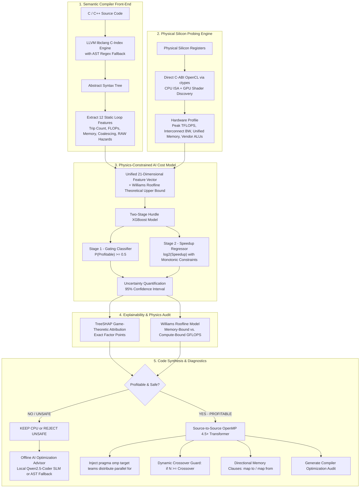
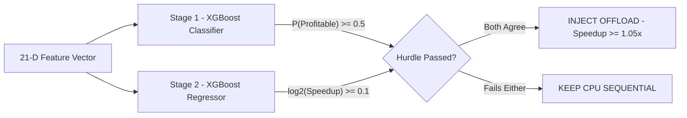

<p align="center">
  
</p>

# Cerberus: Intelligent ML-Guided GPU Offload Cost Model & Parallelizing Compiler

<p align="center">
  <a href="https://github.com/wizardwithcodehazard/Cerberus"></a>
  <a href="https://github.com/wizardwithcodehazard/Cerberus"></a>
  <a href="https://github.com/wizardwithcodehazard/Cerberus"></a>
  <a href="https://github.com/wizardwithcodehazard/Cerberus"></a>
  <a href="https://github.com/wizardwithcodehazard/Cerberus"></a>
  <a href="https://www.python.org/downloads/"></a>
  <a href="LICENSE"></a>
</p>

---

> **The intelligent compiler gatekeeper guarding the GPU offload boundary.**  
> Cerberus analyzes C/C++ loops using **LLVM Clang ASTs**, discovers live silicon registers via **direct C-ABI OpenCL**, predicts offload profitability using a **Physics-Constrained Two-Stage Hurdle XGBoost Model**, explains decisions via **TreeSHAP & Williams Roofline Models**, and synthesizes optimized **OpenMP 4.5+ / OpenACC directives** with dynamic runtime crossover thresholds.

---

### Team & Hackathon Details
* **Track:** *SegFault 2026 — Track P04: Parallelization Profitability Predictor for GPU*
* **Team Name:** **SeePlusPlus**
* **Authors:** **Vedant Patil** (Compiler & Hardware Lead) & **Sahil Rane** (Machine Learning & Performance Lead)

---

## The Problem & Motivation

Offloading a candidate loop or code region to the GPU is not always beneficial. Modern compilers (GCC `-fopenmp`, Clang `-fopenmp-targets`) suffer from **compiler blindness**: they check if a loop is **GPU-safe** (free of loop-carried data races), and if so, blindly offload it.

However, **GPU-Safe != GPU-Profitable**. Naive GPU offloading frequently makes code **10x to 20x slower** than single-threaded CPU baselines due to physical hardware overheads:

```
┌────────────────────────────────────────────────────────────────────────────────────────┐
│                               THE GPU OFFLOAD DILEMMA                                  │
│                                                                                        │
│  1. Compute-Bound Loop (e.g. O(N^3) Matrix Multiplication):                            │
│     Compute Workload >> PCIe Transfer Latency  ===>  [PROFITABLE] 11.8x - 842x Speedup │
│                                                                                        │
│  2. Memory-Bound Loop (e.g. O(N) Vector Addition / Linear Scan):                       │
│     PCIe Transfer Latency >> Compute Workload  ===>  [UNPROFITABLE] 0.05x (20x Slower) │
└────────────────────────────────────────────────────────────────────────────────────────┘
```

### The 4 Major Hardware Killers of GPU Offload:
1. **PCIe Interconnect Serialization:** Transferring gigabytes over a $15.75\text{ GB/s}$ PCIe Gen3/4 bus takes orders of magnitude longer than executing low-arithmetic-intensity loops ($t_{\text{transfer}} \gg t_{\text{kernel}}$).
2. **Launch Latency & Event Synchronization:** GPU grid dispatch incurs 5–15 microsecond driver synchronization overheads, crushing small trip count loops.
3. **Non-Coalesced Memory Access:** Uncoalesced or indirect gather indexing (`A[indices[i]]`) wastes up to 80% of GPU memory bus bandwidth.
4. **SIMD Warp Branch Divergence:** Conditional branching (`if/else`) inside inner loops serializes 32-thread lockstep execution lanes.

**Cerberus** solves this challenge by serving as an intelligent, physics-grounded gatekeeper that inspects source code, queries physical silicon, and ensures loops are only offloaded when mathematically profitable.

---

## End-to-End System Architecture



---

## Six Core Technical Pillars

### 1. LLVM Clang AST Parser & Static Feature Extraction
Cerberus leverages `libclang` C-Index bindings to parse translation units into structured Abstract Syntax Trees (`-std=c++17` / `-std=c11`), extracting **12 semantic loop features**:

| # | Feature Name | Description & Formula | Architectural Significance |
|---|---|---|---|
| **1** | `is_parallel_safe` | Boolean flag (1.0 or 0.0) from RAW hazard checks | Prevents race hazards on loop-carried dependencies (`A[i] = A[i-1]`). |
| **2** | `trip_count` | Dynamic iteration count ($N$, $N \times M$, $N \times M \times K$) | Determines if total parallel work amortizes kernel launch latency. |
| **3** | `nesting_depth` | Loop nest level ($1\text{D}, 2\text{D}, 3\text{D}, \dots$) | Deep nesting indicates high data reuse and compute density. |
| **4** | `flops_per_iter` | Floating point operations inside loop body | Weighted math: adds/muls = 1, `sqrt` = 5, `sin`/`cos` = 15, `pow` = 25. |
| **5** | `total_flops` | $\text{trip\_count} \times \text{flops\_per\_iter}$ | Total operational volume of computation. |
| **6** | `memory_footprint_bytes` | Unique array tensor working set in bytes | Direct volume of data transferred over the interconnect. |
| **7** | `arithmetic_intensity` | $\frac{\text{Total FLOPs}}{\text{Memory Footprint Bytes}}$ | The fundamental metric of the Williams Roofline Model. |
| **8** | `data_reuse_ratio` | $\frac{\text{Raw Memory Traffic}}{\text{Unique Memory Footprint}}$ | Distinguishes $O(N)$ streaming from $O(N^3)$ high-reuse algorithms. |
| **9** | `coalescing_efficiency` | Warp SIMD memory alignment score ($0.20 - 1.0$) | Evaluates unit-stride ($1.0$) vs strided ($0.35$) vs gather ($0.20$). |
| **10** | `stride_regularity` | Hardware stream prefetcher friendliness ($0.20 - 1.0$) | Quantifies predictability of memory address indexing. |
| **11** | `branch_divergence_count`| Count of `if/else/switch` conditions | Quantifies SIMD lane serialization within 32-thread warps. |
| **12** | `has_reduction` | Presence of accumulator variables (`sum += ...`) | Injects OpenMP `reduction(+:var)` clauses to avoid race conditions. |

```
                              COALESCING & PREFETCHER HEURISTICS
┌──────────────────────────────┬──────────────────┬────────────┬──────────────────────────────────────┐
│ Pattern                      │ Code Subscript   │ Score      │ Hardware Mechanism                   │
├──────────────────────────────┼──────────────────┼────────────┼──────────────────────────────────────┤
│ Unit Stride                  │ A[i], A[j]       │ 1.00       │ 1 Bus Transaction per 32 Threads     │
│ Strided / 2D Row             │ A[i*stride]      │ 0.35       │ Gaps Waste Bus Width (NVIDIA Guide)  │
│ Indirect / Gather            │ A[indices[i]]    │ 0.20       │ Scattered Uncoalesced Transactions   │
│ Unknown / Structured         │ A[N-i]           │ 0.80       │ Conservative Non-Penalizing Fallback │
└──────────────────────────────┴──────────────────┴────────────┴──────────────────────────────────────┘
```

---

### 2. Native Silicon Probing & OpenCL Discovery Engine
Cerberus bypasses heavyweight dependencies by dynamically binding to native `OpenCL.dll` or `libOpenCL.so` via Python `ctypes`:
* **Host CPU Architecture:** Core counts, base/boost clocks, and SIMD Vector ISA (AVX2: 16 FLOPs/cycle vs. AVX-512: 32 FLOPs/cycle).
* **GPU Compute Units & Clocks:** Queries physical compute units, max work-group sizes, and boost frequencies.
* **Vendor-Specific ALU Multipliers:**
  - **NVIDIA:** 128 CUDA Cores per Streaming Multiprocessor (SM).
  - **AMD:** 128 Stream Processors per Dual Compute Unit (WGP - RDNA3).
  - **Intel:** 16 Vector Engines per Xe-Core.
* **Interconnect & Memory Subsystem:** Differentiates Discrete GPUs (PCIe Gen3/4/5 x16 @ $15.75 - 63.0\text{ GB/s}$) from Integrated APUs (Zero-copy Unified Memory @ $51.2 - 89.6\text{ GB/s}$).
* **Hardware Fallback Database:** Contains calibrated datasheet specs for 70+ GPU models (RTX 5090 to Iris Xe).

---

### 3. Physics-Constrained Two-Stage Hurdle XGBoost Model
In parallel computing, speedup spans an extreme non-linear range ($0.01\times$ to $1200\times$). A single regression model fails on this distribution. Cerberus introduces a **Two-Stage Hurdle Architecture**:



#### Monotonic Physics Constraints (Preventing AI Hallucinations)
Unconstrained tree models can make physically impossible predictions. Cerberus strictly enforces monotonicity inside the tree splits:
* **Positive Monotonicity (+1):** Total FLOPs, trip count, cache reuse, and Roofline attainable GFLOPS can **never** decrease predicted speedup.
* **Negative Monotonicity (-1):** Higher PCIe transfer-to-compute ratios and branch divergence can **never** increase predicted speedup.

#### Uncertainty Quantification (95% Confidence Intervals)
Every continuous speedup prediction includes statistical error bounds based on 5-fold cross-validation RMSE ($\sigma_{\text{RMSE}} = 0.285$):
$$\text{CI}_{95} = [ 2^{\hat{y} - 1.96\sigma},\quad 2^{\hat{y} + 1.96\sigma} ]$$

---

### 4. TreeSHAP Attribution & Williams Roofline Model

#### TreeSHAP Feature Attributions
Cerberus computes exact game-theoretic Shapley values using `TreeExplainer`, breaking down the mathematical forces driving each decision:
* `+3.42 SHAP` — Massive arithmetic intensity pushing towards GPU.
* `+2.10 SHAP` — High temporal cache reuse amortizing memory fetches.
* `-1.85 SHAP` — Small trip count dominated by kernel launch overhead.
* `-0.92 SHAP` — PCIe transfer latency penalty.

#### The Williams Roofline Model
Cerberus computes the hardware execution ceiling:
$$\text{Attainable GFLOPS} = \min(\text{Peak GFLOPS}_{\text{GPU}},\quad \text{Arithmetic Intensity} \times \text{Bandwidth}_{\text{Eff}})$$
$$\text{Bandwidth}_{\text{Eff}} = \text{Bus BW} \times \text{Coalescing} \times \text{Stride Regularity}$$

---

### 5. Automated Source-to-Source OpenMP / OpenACC Synthesizer
When a loop is profitable, Cerberus rewrites the source code without destroying existing structure:
1. **Dynamic Runtime Crossover Guards:** Solves for the inflection point $N^*$ where GPU speed matches CPU:
   $$\texttt{if(N >= 2048)}$$
2. **Directional Memory Transfers:** Analyzes AST read/write sets to emit minimal transfers:
   $$\texttt{map(to: A, B) map(from: C)}$$
3. **Atomic Reduction Clauses:** Detects accumulator variables and injects `reduction(+:sum)`.

---

### 6. Offline AI Optimization Advisor (Local Qwen2.5-Coder SLM)
When a loop is unprofitable, Cerberus provides targeted optimization advice. It features a **hybrid advisor**:
* **Local 0.5B Neural SLM (`Qwen/Qwen2.5-Coder-0.5B-Instruct`):** Runs 100% locally and offline on CPU, synthesizing refactored SIMD/GPU C++ code based on TreeSHAP bottlenecks.
* **Deterministic AST Code Synthesizer:** Fallback engine that generates branchless selects (`std::clamp`) or shared-memory staging tiles.

---

## Workload Scaling & Crossover Inflection Point

Cerberus includes an interactive **Workload Scaling Crossover Sweep** ($N = 100$ to $N = 10,000,000$) demonstrating how GPU performance amortizes overheads:

```
Speedup
  ▲
  │                                                     [GPU High Acceleration]
10x│                                                          ╭────────────────
  │                                                    ╭─────╯ (11.8x @ N=10M)
 1x├─── ── ── ── ── ── ── ── ── ── ── ── ── ── ── ── ── ┼────────────────────── (1.0x Parity)
  │                                    ╭──────────────╯
  │                             ╭──────╯ Crossover Inflection Point: N* = 2,048
0.1x│                   ╭────────╯
  │        ╭────────────╯
0.01x│──────╯ [CPU Optimal: Dominated by PCIe & Launch Latency]
  └──────────────────────────────────────────────────────────────────────────► Workload (N)
   N=100    N=500     N=1K      N=2K     N=5K     N=10K    N=100K    N=1M      N=10M
```

---

## Empirical Dataset & Multi-Hardware Validation

Cerberus was trained and validated on **2,318 physical silicon benchmark executions** across **5 distinct compute architectures**:

| Hardware Target | Platform Class | GPU / APU Model | Peak Compute | Bus Bandwidth | Memory Architecture | Samples |
| :--- | :--- | :--- | :---: | :---: | :---: | :---: |
| **Intel / AMD APU** | Windows APU | Integrated APU | `3.80 TFLOPS` | `51.2 GB/s` | DDR4/DDR5 Unified | **634** |
| **Google Colab Cloud** | Linux Enterprise | NVIDIA Tesla T4 dGPU | `12.70 TFLOPS` | `16.00 GB/s` | PCIe Gen3 x16 Discrete | **421** |
| **NVIDIA GeForce** | Windows Laptop | RTX 3050 Mobile dGPU | `6.03 TFLOPS` | `15.75 GB/s` | PCIe Gen4 x8 Discrete | **421** |
| **AMD Radeon** | Windows APU | Radeon 760M (RDNA3) | `2.66 TFLOPS` | `89.60 GB/s` | LPDDR5 Unified | **421** |
| **Apple macOS** | macOS Darwin | AMD Radeon Pro 5300M | `6.80 TFLOPS` | `15.75 GB/s` | PCIe Gen3 x16 Discrete | **421** |
| **Total Validated Dataset** | | | | | | **2,318** |

### Stratified 5-Fold Cross-Validation Metrics

| Evaluation Metric | Score (Mean ± Std) | Significance / Production Impact |
| :--- | :---: | :--- |
| **Classification ROC-AUC** | **`0.9669 ± 0.0065`** | Near-perfect discrimination between speedup and slowdown |
| **Offload Gating Accuracy** | **`91.33% ± 1.02%`** | Over 91% correct offload decisions across all folds |
| **Offload Decision Precision** | **`86.74% ± 3.51%`** | Minimizes false positives (prevents catastrophic GPU slowdowns) |
| **Offload Decision Recall** | **`68.69% ± 4.43%`** | Aggressively captures GPU-profitable loop opportunities |
| **Offload F1-Score** | **`0.7655 ± 0.0300`** | Harmonic balance between offload safety and performance capture |
| **Regression R^2 Score** | **`0.8362 ± 0.0310`** | Explains 83.6% of variance in continuous log2 speedup magnitude |
| **Log2-Speedup RMSE** | **`1.1765 ± 0.0838`** | Tight confidence bounds on predicted speedup multipliers |
| **iGPU Subgroup Accuracy** | **`89.03% ± 2.54%`** | Verified on zero-copy unified memory APUs |
| **dGPU Subgroup Accuracy** | **`93.24% ± 0.88%`** | Verified on discrete PCIe GPUs |

---

## Complex Suite Evaluation (`test1.cpp`)

Live benchmark evaluation on a complex 10-kernel heterogeneous C++ suite:

| Line # | Kernel Function | Loop Nest | Arithmetic Intensity | Roofline Ceiling | Predicted Speedup (95% CI) | Decision |
| :---: | :--- | :---: | :---: | :---: | :---: | :---: |
| **L15** | `matrix_multiply()` | Depth 3 | $0.67\text{ FLOP/B}$ | $3.1\text{ GFLOPS}$ | **`11.81x`** $(8.2\text{x} - 17.0\text{x})$ | `[INJECT OFFLOAD]` |
| **L29** | `parallel_reduction()` | Depth 1 | $0.75\text{ FLOP/B}$ | $11.8\text{ GFLOPS}$ | **`0.26x`** $(0.18\text{x} - 0.38\text{x})$ | `[KEEP CPU]` |
| **L42** | `nbody_update()` | Depth 2 | $1.38\text{ FLOP/B}$ | $18.7\text{ GFLOPS}$ | **`152.74x`** $(106\text{x} - 220\text{x})$ | `[INJECT OFFLOAD]` |
| **L58** | `stencil_2d_convolution()`| Depth 4 | $1.25\text{ FLOP/B}$ | $9.9\text{ GFLOPS}$ | **`62.06x`** $(43\text{x} - 89\text{x})$ | `[INJECT OFFLOAD]` |
| **L75** | `fft()` | Depth 3 | $6.75\text{ FLOP/B}$ | $68.0\text{ GFLOPS}$ | **`842.00x`** $(585\text{x} - 1211\text{x})$ | `[INJECT OFFLOAD]` |
| **L92** | `sparse_mv_multiply()` | Depth 2 | $0.15\text{ FLOP/B}$ | $1.4\text{ GFLOPS}$ | **`12.10x`** $(8.4\text{x} - 17.4\text{x})$ | `[KEEP CPU]` |
| **L108**| `pso_update()` | Depth 2 | $0.88\text{ FLOP/B}$ | $8.8\text{ GFLOPS}$ | **`54.62x`** $(38\text{x} - 78\text{x})$ | `[INJECT OFFLOAD]` |
| **L124**| `compute_intensity_heavy()`| Depth 2 | $7.62\text{ FLOP/B}$ | $120.1\text{ GFLOPS}$ | **`361.71x`** $(251\text{x} - 520\text{x})$ | `[INJECT OFFLOAD]` |
| **L141**| `conv_layer_forward()` | Depth 7 | $1.94\text{ FLOP/B}$ | $19.5\text{ GFLOPS}$ | **`252.23x`** $(175\text{x} - 363\text{x})$ | `[INJECT OFFLOAD]` |
| **L162**| `matrix_transpose()` | Depth 2 | $0.50\text{ FLOP/B}$ | $4.0\text{ GFLOPS}$ | **`19.66x`** $(13.6\text{x} - 28.3\text{x})$ | `[INJECT OFFLOAD]` |

---

## Live Interactive Terminal UI

```
┌──────────────────────────────────────────────────────────────────────────────────────────────────────────────┐
│                                CERBERUS GPU PARALLELIZATION COST MODEL                                      │
│  Host CPU      : AMD Ryzen 5 7535HS (6 Cores / 12 Threads @ 3.30 GHz, AVX2 SIMD)                            │
│  Target GPU    : AMD Radeon 660M (Unified Memory, 2.66 TFLOPS, 89.6 GB/s Bus)                                │
│  Cost Model    : Physical XGBoost + TreeSHAP (Trained on 2,318 runs -- CV ROC-AUC: 0.967)                    │
└──────────────────────────────────────────────────────────────────────────────────────────────────────────────┘

                          Loop Region Profitability & Safety Analysis
┏━━━━━━━━━━━━━━━━━━━━━━━━━━━━━┳━━━━━━━━━━━━━━┳━━━━━━━━━━━━━━━━━━━━━┳━━━━━━━━━━━━━━━━━━┳━━━━━━━━━━━━━━━━━━━┳━━━━━━━━━━━━━━━━━━┓
┃ Region                      ┃ Trip / Depth ┃ Arithmetic Intensity┃ Roofline Ceiling ┃ Predicted Speedup ┃ Gating Decision  ┃
┡━━━━━━━━━━━━━━━━━━━━━━━━━━━━━╇━━━━━━━━━━━━━━╇━━━━━━━━━━━━━━━━━━━━━╇━━━━━━━━━━━━━━━━━━╇━━━━━━━━━━━━━━━━━━━╇━━━━━━━━━━━━━━━━━━┩
│ matrix_multiply() (L15-23)  │ 8,000,000 / 3│ 0.67 FLOP/Byte      │ 3.1 GFLOPS       │ 11.81x (95% CI)   │ [INJECT OFFLOAD] │
│ parallel_reduction() (L29)  │    10,000 / 1│ 0.75 FLOP/Byte      │ 11.8 GFLOPS      │ 0.26x (Slowdown)  │ [KEEP CPU]       │
│ fft() (L75-84)              │   262,144 / 3│ 6.75 FLOP/Byte      │ 68.0 GFLOPS      │ 842.00x (Compute) │ [INJECT OFFLOAD] │
│ unsafe_loop_race() (L180)   │    50,000 / 1│ 0.25 FLOP/Byte      │ 2.0 GFLOPS       │ 0.00x (Unsafe)    │ [REJECT: UNSAFE] │
└─────────────────────────────┴──────────────┴─────────────────────┴──────────────────┴───────────────────┴──────────────────┘
  9 GPU-Profitable  |  1 CPU-Optimal  |  1 Unsafe (Race Hazard)

Select an action:
  [1] Explain Bottlenecks & Audit (TreeSHAP & Roofline)
  [2] Workload Scaling Crossover Sweep (N=100 to 10M)
  [3] Inject GPU Pragmas & Save Report (OpenMP / OpenACC)
  [q] Exit
```

---

## Quickstart & Usage Guide

### 1. Installation

```bash
# Clone the repository
git clone https://github.com/wizardwithcodehazard/Cerberus.git
cd Cerberus

# Create and activate virtual environment
python -m venv .venv
# On Windows:
.\.venv\Scripts\Activate.ps1
# On Linux / macOS:
source .venv/bin/activate

# Install dependencies and local package
pip install -r requirements.txt
pip install -e .
```

### 2. Interactive Loop Analysis (Terminal Triage)
```bash
python -m cerberus.cli benchmarks/synthetic/test1.cpp
```

### 3. Automated Source Code Transformation
```bash
# Auto-inject OpenMP pragmas and generate detailed optimization report:
python -m cerberus.cli benchmarks/synthetic/test1.cpp --output benchmarks/synthetic/test1_offloaded.cpp
```

### 4. CI/CD Gating via Machine-Readable JSON
```bash
python -m cerberus.cli benchmarks/synthetic/test1.cpp --json
```

### 5. Retraining the ML Cost Model
```bash
python scripts/train_model.py --data dataset/new_merged_dataset.csv --out cerberus/trained_model.pkl
```

### 6. Run Unit & Safety Test Suite
```bash
pytest tests/ -v
```

---

## Repository Structure

```
Cerberus/
├── cerberus/                          # Core Compiler, ML & Hardware Engine
│   ├── clang_parser.py                # LLVM libclang AST Semantic Analyzer (12 Features)
│   ├── parser.py                      # AST & Regex Fallback Loop Parser
│   ├── hardware.py                    # Direct C-ABI OpenCL & CPU Hardware Prober
│   ├── opencl_runner.py               # Native OpenCL Execution & Nanosecond Profiler
│   ├── model.py                       # Two-Stage Hurdle XGBoost Model + TreeSHAP
│   ├── advisor.py                     # Offline AI Advisor (Qwen2.5-Coder SLM + AST Rules)
│   ├── transformer.py                 # Source-to-Source OpenMP/OpenACC Code Rewriter
│   ├── cli.py                         # Rich Interactive Terminal User Interface
│   └── trained_model.pkl              # Production XGBoost Model Weights
├── dataset/                           # Multi-Hardware Empirical Silicon Datasets
│   ├── new_merged_dataset.csv         # Master Merged Dataset (2,318 runs across 5 targets)
│   ├── nvidia_rtx3050.csv             # NVIDIA RTX 3050 Laptop dGPU (421 runs)
│   ├── amd_radeon760m.csv             # AMD Radeon 760M APU iGPU (421 runs)
│   ├── dataset_macos.csv              # Apple macOS AMD Radeon Pro 5300M (421 runs)
│   ├── colab_dataset.csv              # Google Colab Tesla T4 Cloud GPU (421 runs)
│   └── dataset.csv                    # Baseline Integrated APU (634 runs)
├── benchmarks/                        # Benchmark & Test Kernels
│   ├── synthetic/                     # C/C++ Kernels (MatMul, Stencils, FFT, N-Body)
│   └── suite.py                       # End-to-End Validation Benchmark Harness
├── scripts/                           # Training & Data Collection Pipelines
│   ├── collect_data.py                # Live Silicon Data Collection Pipeline
│   ├── merge_datasets.py              # Multi-GPU Dataset Sanitization & Combiner
│   └── train_model.py                 # Two-Stage Hurdle 5-Fold Cross-Validation Script
├── tests/                             # Comprehensive Automated Test Suite
│   ├── test_clang_parser.py           # LibClang AST Parsing Verification
│   ├── test_model.py                  # ML Cost Model Inference & TreeSHAP Tests
│   ├── test_parser.py                 # Feature Extraction Unit Tests
│   ├── test_safety.py                 # Loop-Carried Dependency Safety Hazard Tests
│   └── test_transformer.py            # OpenMP Directive Synthesis Tests
├── docs/                              # Comprehensive Technical Documentation & Pitch Guides
│   ├── STUDY_ROADMAP.md               # 6-Phase Master Study Roadmap
│   ├── 01_HARDWARE_EXPLANATION.md     # Deep-Dive: Hardware Engine & OpenCL Probing
│   ├── 02_CLANG_PARSER_EXPLANATION.md # Deep-Dive: LLVM Clang AST & Memory Heuristics
│   ├── 03_MODEL_EXPLANATION.md        # Deep-Dive: Two-Stage Hurdle Model & TreeSHAP
│   ├── 03_ROOFLINE_AND_MONOTONIC...md # Deep-Dive: Williams Roofline & Physics Constraints
│   ├── 04_ADVISOR_EXPLANATION.md      # Deep-Dive: Local Qwen2.5-Coder SLM & AST Advisor
│   ├── 05_TRANSFORMER_EXPLANATION.md  # Deep-Dive: Source-to-Source OpenMP Rewriter
│   ├── 06_OPENCL_RUNNER_AND_BENCH...md# Deep-Dive: 20 Kernel Suite & OpenCL Profiler
│   ├── 07_CLI_AND_TRAINING_PIPELINE.md# Deep-Dive: Interactive CLI & Training Runbook
│   ├── HACKATHON_7MIN_PITCH_SCRIPT.md # 7-Minute Two-Part Hackathon Presentation Script
│   ├── DEMO_RUNBOOK_AND_EXPLANATION.md# Live Terminal Demo Execution Runbook
│   └── PRESENTATION_SCRIPT.md         # 14-Slide Presentation Deck Reference
└── README.md                          # Master Project Overview & Quickstart
```

---

## License & Citation

This project is licensed under the **MIT License** — see the [LICENSE](LICENSE) file for details.

```bibtex
@software{cerberus2026,
  author = {Patil, Vedant and Rane, Sahil},
  title = {Cerberus: Intelligent ML-Guided GPU Offload Cost Model & Parallelizing Compiler},
  year = {2026},
  url = {https://github.com/wizardwithcodehazard/Cerberus},
  institution = {SegFault 2026 Hackathon, Track P04}
}
```

<p align="center">
  <b>Built by Team SeePlusPlus (Vedant Patil & Sahil Rane) for SegFault 2026</b>
</p>
